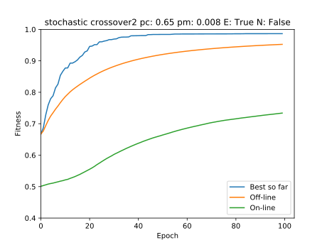
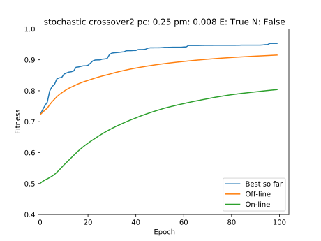

# Lab 3

## Setup

Para ejecutar el código:

**Es necesario python 3.6+**

1. Clonar el repo.
2. Instalar dependencias (`Pipfile`)
3. Entrar a la carpeta `lab_3`
4. Ejecutar `python lab_3.py` con los parámetros necesarios, ejemplo:
    ```
    python lab_3.py 40 100 20 crossover1 0.65 0.008 true false
    ```


## Comparación entre estretegias de selección
#### Parámetros de los experimentos realizados
* 100 individuos 
* 40 generaciones 
* pc = 65%, 
* pm = 0.8%
* Operador de cruce: 1 punto
* Elitismo

### Selección por ruleta
```
python lab_3.py 40 100 20 crossover1 roulette 0.65 0.008 true false
```


Fitness final promedio: `0.982869` 

### Sobrante estocástico

```
python lab_3.py 40 100 20 crossover1 stochastic 0.65 0.008 true false
```


Fitness final promedio: `0.980807` 

### Selección por torneo

```
python lab_3.py 40 100 20 crossover1 tournament 0.65 0.008 true false
```


Fitness final promedio: `0.977518` 

---
Para los siguintes experimentos, se escogió el sobrante estocástico, debido
a que converge más rápido que la selección por ruleta y tiene mejores de
sultados que la selección por torneo.

## Comparación entre operadores de cruce
#### Parámetros de los experimentos realizados
* 100 individuos 
* 40 generaciones 
* pc = 65%, 
* pm = 0.8%
* Estrategia de selección: Sobrante estocástico
* Elitismo

### Cruce de un punto
```
python lab_3.py 40 100 20 crossover1 stochastic 0.65 0.008 true false
```


Fitness final promedio: `0.980807` 

### Cruce de dos puntos

```
python lab_3.py 40 100 20 crossover2 stochastic 0.65 0.008 true false
```



Fitness final promedio: `0.986452` 

### Cruce uniforme

```
python lab_3.py 40 100 20 crossover_uniform stochastic 0.65 0.008 true false
```


Fitness final promedio: `0.989862`

---
Observando los gráficos, se observa que en promedio, usando cruce de dos puntos se obtienen mejores valores que usando los otros dos cruces y que al usar este operador de cruce los individuos de la población convergen más rápido

## Comparación entre probabilidades de cruce y mutación
#### Parámetros de los experimentos realizados
* 100 individuos 
* 40 generaciones 
* Estrategia de selección: Sobrante estocástico
* Operador de cruce: cruce de dos puntos
* Elitismo

### pc = 65%, pm = 0.8%

```
python lab_3.py 40 100 20 crossover2 stochastic 0.65 0.008 true false
```


Fitness final promedio: `0.986452` 

### pc = 85%, pm = 0.8%

```
python lab_3.py 40 100 20 crossover2 stochastic 0.85 0.008 true false
```


Fitness final promedio: `0.987345`

### pc = 55%, pm = 0.8%

```
python lab_3.py 40 100 20 crossover2 stochastic 0.55 0.008 true false
```


Fitness final promedio: `0.990857` 

### pc = 25%, pm = 0.8%

```
python lab_3.py 40 100 20 crossover2 stochastic 0.25 0.008 true false
```



Fitness final promedio: `0.97386` 

### pc = 65%, pm = 0.4%

```
python lab_3.py 40 100 20 crossover2 stochastic 0.65 0.004 true false
```


Fitness final promedio: `0.989474` 

### pc = 65%, pm = 1.0%

```
python lab_3.py 40 100 20 crossover2 stochastic 0.65 0.01 true false
```


Fitness final promedio: `0.98714` 

### pc = 65%, pm = 2.0%

```
python lab_3.py 40 100 20 crossover2 stochastic 0.65 0.02 true false
```


Fitness final promedio: `0.991799` 


### pc = 65%, pm = 5.0%

```
python lab_3.py 40 100 20 crossover2 stochastic 0.65 0.05 true false
```


Fitness final promedio: `0.981727` 

---
Se puede observar que tanto incrementar o dismunuir mucho las probabilidades de cruce y mutación hace que los resultados varíen notablemente.

## Otras comparaciones
#### Parámetros de los experimentos realizados
* 100 individuos 
* 40 generaciones 
* pc = 65%, 
* pm = 0.8%
* Estrategia de selección: Sobrante estocástico
* Operador de cruce: cruce de dos puntos


### Sin elitismo ni normalización lineal

```
python lab_3.py 40 100 20 crossover2 stochastic 0.65 0.008 false false
```


Fitness final promedio: `0.857016` 

### Solo elitismo

```
python lab_3.py 40 100 20 crossover2 stochastic 0.65 0.008 true false
```


Fitness final promedio: `0.986452` 

# Normalización lineal [10, 60] y elitismo

# Normalización lineal [1, 200] y elitismo