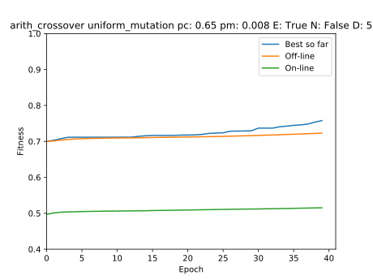

# Lab 4

## Setup

Para ejecutar el código:

**Es necesario python 3.6+**

1. Clonar el repo.
2. Instalar dependencias (`Pipfile`)
3. Entrar a la carpeta `lab_4`
4. Ejecutar `python lab_4.py` con los parámetros necesarios, ejemplo:
    ```
    python lab_4.py 2 100 40 20 arith_crossover uniform_mutation stochastic 0.65 0.008 true false
    ```


## Comparación entre operadores de cruce y mutación
#### Parámetros de los experimentos realizados
* 100 individuos 
* 40 generaciones 
* pc = 65%, 
* pm = 0.8%
* Elitismo
* Sobrante estocáctico como operador de selección
* Dimensión de `f_6`: 2

### Cruce aritmético

#### Con mutación uniforme

```
python lab_4.py 2 100 40 20 arith_crossover uniform_mutation stochastic  0.65 0.008 true false
```


Valor `x*` y `f(x*)`:  [9.08899644 2.43526283]   ->  0.9910355203753772


#### Con mutación de frontera

```
python lab_4.py 2 100 40 20 arith_crossover frontier_mutation stochastic  0.65 0.008 true false
```


Valor `x*` y `f(x*)`: [ 3.93162011 12.01471091]   ->  0.9789165501400565

#### Con mutación no uniforme

```
python lab_4.py 2 100 40 20 arith_crossover non_uniform_mutation stochastic  0.65 0.008 true false
```


Valor `x*` y `f(x*)`:  [13.43341099  8.13300158]   ->  0.976204523350551


### Cruce simple

#### Con mutación uniforme

```
python lab_4.py 2 100 40 20 simple_crossover uniform_mutation stochastic  0.65 0.008 true false
```


Valor `x*` y `f(x*)`:  [1.77679476 9.24874402]   ->  0.9912001078331243


#### Con mutación de frontera

```
python lab_4.py 2 100 40 20 simple_crossover frontier_mutation stochastic  0.65 0.008 true false
```


Valor `x*` y `f(x*)`: [ 2.1004175  15.47202398]   ->  0.9680849938409952

#### Con mutación no uniforme

```
python lab_4.py 2 100 40 20 simple_crossover non_uniform_mutation stochastic  0.65 0.008 true false
```


Valor `x*` y `f(x*)`:  [ 1.12773021 12.46048525]   ->  0.9817815249564568

### Cruce heurístico

#### Con mutación uniforme

```
python lab_4.py 2 100 40 20 heuristic_crossover uniform_mutation stochastic  0.65 0.008 true false
```


Valor `x*` y `f(x*)`:  [ 6.28551592 14.49283319]   ->  0.9683975198313123


#### Con mutación de frontera

```
python lab_4.py 2 100 40 20 heuristic_crossover frontier_mutation stochastic  0.65 0.008 true false
```


Valor `x*` y `f(x*)`: [34.50478523 14.55682103]   ->  0.8377113130835843

#### Con mutación no uniforme

```
python lab_4.py 2 100 40 20 heuristic_crossover non_uniform_mutation stochastic  0.65 0.008 true false
```


Valor `x*` y `f(x*)`:  [0.80294388 6.30670709]   ->  0.9904972663504372

## Comparación entre distintas dimensionalidades de f_6

En los experimentos anteriores los mejores resultados se obtuvieron con estas convinaciones:
* Cruce aritmético con mutación uniforme
* Cruce simple con mutación uniforme
* Cruce heurístico con mutación no uniforme

Para este experimento se eligió el cruce aritmético con mutación uniforme, ya
que de los tres que obtienen mejores resultados, es el que se ejecuta más
rápido.

### Con 2 dimensiones

```
python lab_4.py 2 100 40 20 arith_crossover uniform_mutation stochastic  0.65 0.008 true false
```


Valor `x*` y `f(x*)`:  [9.08899644 2.43526283]   ->  0.9910355203753772


### Con 5 dimensiones

```
python lab_4.py 5 100 40 20 arith_crossover uniform_mutation stochastic  0.65 0.008 true false
```



Valor `x*` y `f(x*)`: 

[ 19.6892313   43.02506802  22.17865502 -11.33260557  26.315772  ]   ->  0.7674193943192482

### Con 10 dimensiones

```
python lab_4.py 10 100 40 20 arith_crossover uniform_mutation stochastic  0.65 0.008 true false
```


Valor `x*` y `f(x*)`: 

[ 19.6892313   43.02506802  22.17865502 -11.33260557  26.315772  ]   ->  0.7674193943192482
lab_4/imgs/arith_crossover_uniform_mutation_pc:_0.65_pm:_0.008_E:_True_N:_False_D:_10.svg
[20.67901083 52.63657235 21.01421758 32.92399231 37.41253661 46.69892101
 18.33942665 30.89052057 65.96061695 17.93722008]   ->  0.5841701829445569


### Con 50 dimensiones

```
python lab_4.py 10 100 40 20 arith_crossover uniform_mutation stochastic  0.65 0.008 true false
```


Valor `x*` y `f(x*)`: 

[48.24638095 44.54684215 52.83476763 40.53637321 48.60232887 47.895296
 43.12347616 50.97153624 51.77027395 45.15887067 43.83866216 50.85821485
 49.53239379 49.01959281 50.45205583 53.7470936  20.93682657 52.34355649
 42.91539882 24.35614015]   ->  0.5178050960978252


Mientras más dimensiones tiene la función de evaluación, aumenta la
probabilidad de que la repsuesta caiga en un óptimo local, por eso es que la
respuesta empeora mientras vamos aumentando dimensiones